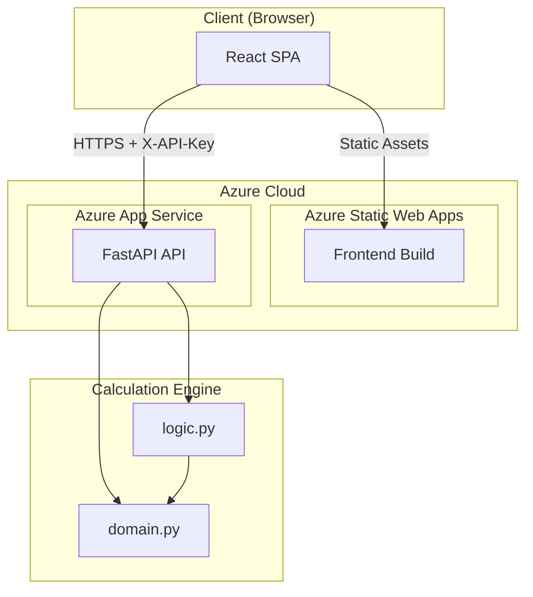
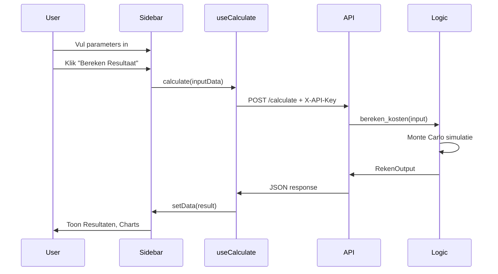

# Bloei Rekenmodule – Architectuuroverzicht

Dit document beschrijft de architectuur van de Bloei Rekenmodule: een full-stack applicatie voor het berekenen van beleggingskosten en vermogensprojecties voor Bloei Vermogen.

---

## 1. Overzicht

| Laag | Technologie |
|------|-------------|
| **Frontend** | React 19 + Vite 7 SPA |
| **Backend** | FastAPI (Python) REST API |
| **Architectuur** | Losgekoppelde full-stack: frontend en backend zijn aparte applicaties met aparte deployments |

---

## 2. Architectuurdiagram



---

## 3. Dataflow



---

## 4. Directorystructuur

```
bloei-calc-demo/
├── frontend/                     # React/Vite SPA
│   ├── public/
│   │   ├── staticwebapp.config.json   # Azure SWA: SPA routing, AAD auth
│   │   └── index.html
│   ├── src/
│   │   ├── main.tsx              # React entry point
│   │   ├── App.tsx               # Root component (layout)
│   │   ├── components/
│   │   │   ├── Sidebar.tsx       # Inputformulier (params, cashflows)
│   │   │   ├── ResultsView.tsx   # Samenvatting metrics
│   │   │   ├── VermogenChart.tsx # Vermogensprojectie-grafiek
│   │   │   └── ComponentChart.tsx # Kostencomponenten-grafiek
│   │   ├── hooks/
│   │   │   └── useCalculate.ts  # API-aanroep + state
│   │   ├── lib/
│   │   │   └── utils.ts
│   │   └── types/
│   │       └── index.ts         # RekenInput, RekenOutput, EenmaligeCashflow
│   ├── package.json
│   ├── vite.config.ts
│   └── .env.production
│
├── backend/                      # FastAPI REST API
│   ├── main.py                  # FastAPI app, /calculate endpoint, API-key auth, CORS
│   ├── requirements.txt
│   ├── .env.example
│   └── bloei_rekenmodel/        # Rekenengine
│       ├── __init__.py
│       ├── domain.py            # Pydantic-modellen (RekenInput, RekenOutput)
│       └── logic.py             # Monte Carlo-simulatie (bereken_kosten)
│
├── .github/workflows/
│   ├── azure-static-web-apps-bloei-rekenmodule.yml   # Frontend → Azure SWA
│   └── main_bloei-rekenmodule.yml                    # Backend → Azure App Service
│
├── test_logic.py                # Standalone test voor rekenengine
├── README.md
└── ARCHITECTURE.md
```

---

## 5. Componenten

### 5.1 Frontend

| Component | Verantwoordelijkheid |
|-----------|----------------------|
| **App.tsx** | Root layout: Sidebar links, resultaten rechts. Beheert loading/error states. |
| **Sidebar** | Inputformulier met react-hook-form + Yup-validatie. Startvermogen, profiel, horizon, cashflows. |
| **ResultsView** | MiFID II-metrics, percentielen (P10–P90), samenvatting. |
| **VermogenChart** | Lijn-/area-chart van vermogensprojectie over tijd. |
| **ComponentChart** | Stacked bar van kostencomponenten (beheer, fonds, spread). |
| **useCalculate** | Custom hook: POST naar `/calculate`, X-API-Key header, error handling met gebruikersvriendelijke berichten. |

### 5.2 Backend

| Component | Verantwoordelijkheid |
|-----------|----------------------|
| **main.py** | FastAPI-app, CORS, API-key authenticatie, `/calculate` endpoint, globale exception handler. |
| **domain.py** | Pydantic-modellen: `RekenInput`, `RekenOutput`, `EenmaligeCashflow`. |
| **logic.py** | Monte Carlo-simulatie: normale rendementen, gelaagde kosten (beheer, fonds, spread), opname-tekort tracking. |

### 5.3 Rekenengine (logic.py)

- **Input:** Startvermogen, profiel, horizon, periodieke/eenmalige cashflows, optioneel afbouw_profiel.
- **Logica:** Monte Carlo met normale verdeling, tiered fees, MiFID II-berekeningen.
- **Output:** MiFID II-metrics, percentielen (P10–P90), tijdlijnen voor vermogen en kosten.

---

## 6. Technische stack

### Frontend

| Categorie | Packages |
|-----------|----------|
| **Core** | React 19, react-dom |
| **Build** | Vite 7, TypeScript 5.9 |
| **Styling** | Tailwind CSS 4, tailwind-merge, clsx |
| **Forms** | react-hook-form, @hookform/resolvers, yup |
| **Charts** | chart.js, react-chartjs-2 |
| **HTTP** | axios |
| **Utils** | date-fns, lucide-react, react-currency-input-field |

### Backend

| Package | Doel |
|---------|------|
| fastapi | REST API |
| pydantic | Validatie, domeinmodellen |
| uvicorn | ASGI-server |
| numpy | Monte Carlo-simulatie |
| python-dotenv | Omgevingsvariabelen |

---

## 7. Deployment

### Frontend (Azure Static Web Apps)

- **Workflow:** `.github/workflows/azure-static-web-apps-bloei-rekenmodule.yml`
- **Triggers:** Push en PR naar `main`
- **Config:** `app_location: frontend`, `output_location: dist`
- **Auth:** Azure AD via `/.auth/login/aad`; routes vereisen `authenticated`
- **Env:** `VITE_API_BASE_URL`, `VITE_API_KEY` (uit secrets)

### Backend (Azure App Service)

- **Workflow:** `.github/workflows/main_bloei-rekenmodule.yml`
- **Triggers:** Push naar `main`, `workflow_dispatch`
- **Target:** App Service `Bloei-rekenmodule`
- **Startup:** `uvicorn main:app --host 0.0.0.0 --port 8000`
- **Secrets:** Azure login (client-id, tenant-id, subscription-id)

---

## 8. Beveiliging

| Aspect | Implementatie |
|--------|---------------|
| **API-key** | `X-API-Key` header vereist voor `/calculate`; key uit `API_KEY` (backend) en `VITE_API_KEY` (frontend). |
| **CORS** | Alleen lokaal actief (localhost:5173); in Azure wordt CORS door SWA afgehandeld. |
| **Auth** | Frontend: Azure AD via Static Web Apps Easy Auth. |
| **Errors** | Backend retourneert generieke foutmeldingen; geen stack traces naar clients. |

---

## 9. Configuratiebestanden

| Bestand | Doel |
|---------|------|
| `frontend/package.json` | Node-dependencies, scripts (`dev`, `build`, `lint`, `preview`) |
| `frontend/vite.config.ts` | Vite + React + Tailwind plugins |
| `frontend/public/staticwebapp.config.json` | Azure SWA: SPA-routing, AAD-auth, 401 → login |
| `backend/requirements.txt` | Python-dependencies |
| `backend/.env.example` | Voorbeeld env (FRONTEND_URL voor CORS) |
